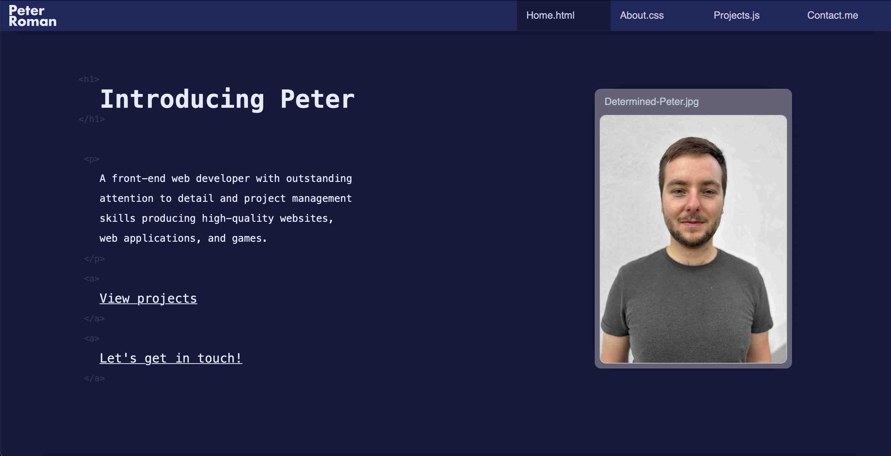

# Peter Roman Portfolio

## Table Of Contents

* [Description](#description)
* [How To Use The Portfolio](#how-to-use-the-portfolio)
* [Design](#design)
* [Code](#code)
* [Feedback](#feedback)
* [Author](#author)

## Description

My name is Peter Roman, and I created this portfolio so that I can showcase my personal and professional projects to the whole world. This portfolio is constantly updated whenever I learn new skills and work on new projects.

Thank you very much for checking it out and I hope you will have a great time!

## How To Use The Portfolio

This portfolio is a fully-responsive single-page application, which can be easily accessed by simply going to <https://peterroman.codes>. Once you're there, you are free to scroll down and discover its content.

The website is divided into four sections:
* Home section
* About section
* Projects section
* Contact section

You can use the navigation or the links in the Home section to skip to any particular section on the website.

The About section includes information about my work experience, skills and education. Each of these sub-sections is further divided into individual work experiences, tech skills, courses, etc. You can read about each of them, click the provided link to check out their website, and to access credentials I have gained for completing the displayed courses.

On desktop, the Projects section is an interactive projects gallery. As the list of projects appears on screen, a MacBook and an iPhone also make an appearance on screen. You can preview each project by moving your cursor over it (images of the project will show up on both the MacBook and the iPhone screens, allowing you to see how to project looks like on different screen sizes), and you can get more info about each project by clicking on them. Once a project is clicked, the list of projects disappears and more information about the chosen project appears. You can now read a detailed description of the project and to click on the provided buttons. Depending on the project, they might lead to the project's website itself, its source code, or its social media. To go back to the projects screen, click the "Back To Projects" button or any of the links in the navigation.

On mobile, the Projects section shows up as a list of projects I worked on that are stacked below one another. You can simply scroll down and view them all along. Each project comes with its own iPhone screen showing a preview of it, as well as a "Project Details" button, which toggles a detailed description of the project. Once again, each project comes with its own buttons which can take you to its website, source code, or social media.

Finally, the Contact section includes a chat window on the bottom, where you can see that a certain Peter Roman sends you text messages! He is very happy that you visited the portfolio and wants to connect. Inside the window, there are buttons which guide you on how to connect with me. 🙂

## Design

Design software used:
* Affinity Designer

Colors used:

| Dark Blue | Light Blue | Accent  | Grey      | Black | 
| --------- | ---------- | ------- | --------- | ----- |
| #1f275d   | #e9ebff    | #10b6ed | #959595   | #000  |
| #151a3d   | #c6c9e0    | #d5628a | #9595953d | -     |
| #151a3d9e | -          | #17a117 | #95959570 | -     |
| #141839   | -          | -       | #636478   | -     |

Fonts used:
* Menlo (monospace)
* Helvetica (sans-serif)

## Code

Technologies used:
* HTML
* CSS
* JavaScript

Concepts applied:

* CSS
    * transitions
    * animations
    * pseudo-classes
    * pseudo-elements
    * variables
    * media queries
* JavaScript
    * control flow
    * web APIs
    * object-oriented programming
    * adding and removing event listeners

### Features

Current features:

* responsive design
    * small screen sizes
        - [x] the navigation is represented as the hamburger icon, which brings the navigation links on screen when clicked
        - [x] the About section has less indentation
        - [x] the projects gallery is represented as projects stacked below one another - each project comes with its own screen showing a preview of the project and a "Project Details button"
        - [x] the chat window shows up in the center of the screen
    * large screen sizes
        - [x] the navigation is fixed to the top
        - [x] the About section has more indentation
        - [x] the projects gallery is represented as a list of projects and a MacBook and iPhone screens next to it - the projects can be previewed and clicked on for more ingo
        - [x] the chat window shows up on the right side of the screen

* interactive navigation
    * the navigation links update:
        - [x] when they are hovered over
        - [x] when they are clicked
        - [x] according to the current page that is in view

* interactive projects gallery
    - [x] a MacBook and an iPhone show up or leave the screen depending on if the list of projects is in view
    * ability to preview each project:
        - [x] images of a project show up on the MacBook and iPhone screens when the users move their cursor over a project
        - [x] images of a project disappear from the MacBook and iPhone screens when the users move their cursor away from project
    * ability to get more info about each project:
        - [x] the list of projects goes away, and a description and buttons show up when a project is clicked
        - [x] the description and buttons go away and the list of projects shows up when a either then "Back To Projects" button or any of the navigation links are clicked

* animated chat bubble
    - [x] a certain Peter Roman starts typing messages as soon as the chat bubble comes into view

Future features:

* the skills in the skills section have a progress bar each instead of values in percentages in order to indicate how well I know them

* draggable image in the hero section

* ability to translate the website to other languages
    - [ ] add a dropdown menu in the navigation, which includes buttons that switch languages
    - [ ] translate the website to Danish
    - [ ] translate the website to Slovak

* ability to switch between a light and dark mode
    - [ ] add a dropdown menu in the navigation, which includes buttons that switch themes
    - [ ] design and code the light mode

### Bugs And Issues (Work In Progress)

* the projects section needs to be refactored
    * currently there is a separate HTML for the small and large screen sizes
    * both of them currently have to be edited separately in case I want to make any change (e.g. edit the paragraph text), which isn't practical
    * there should be only one HTML which changes and adapts to different screen sizes

## Feedback

In case you would like to provide feedback on my portfolio, feel free to contact me at peter.roman24[at]gmail.com.

Any feedback is appreciated as I am always trying to improve my skills and work.

## Author

This portfolio is created and maintained by me, Peter Roman.

Connect with me:
* [GitHub](https://github.com/peterRomanDev)
* [LinkedIn](https://www.linkedin.com/in/proman2/)
